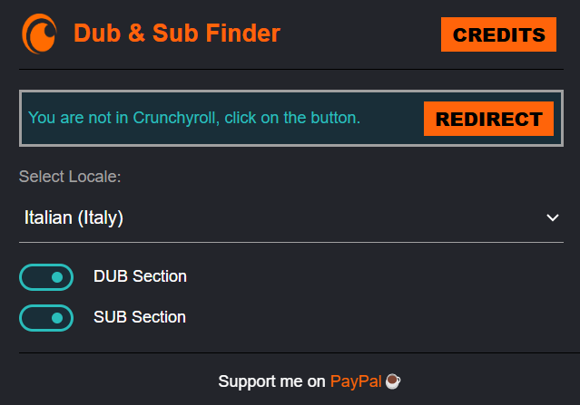
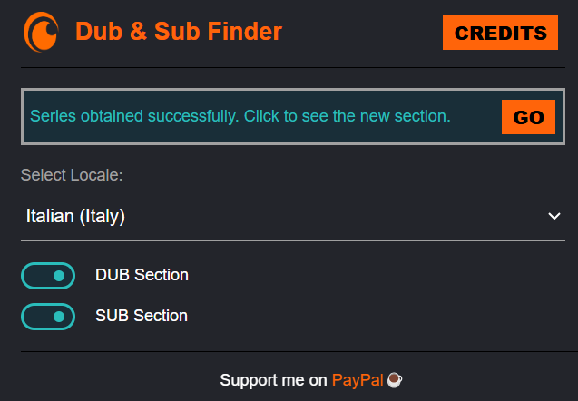
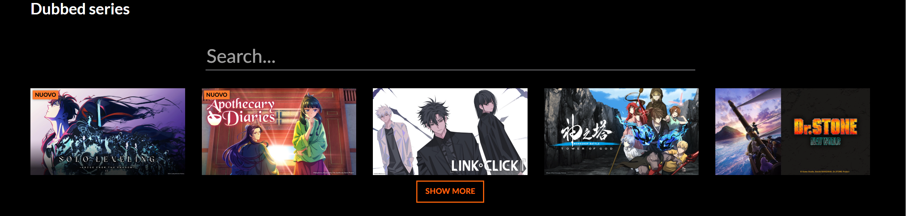

# Crunchyroll: Dub & Sub Finder

This browser extension helps you easily find **Dubbed** and **Subbed** versions of series on Crunchyroll. With just a few clicks, you can toggle between language options, get available series for your locale, and seamlessly switch between dub and sub sections. The extension will automatically detect if you're on Crunchyroll and give you access to a curated list of series.

---

## Features

- **Locale Selector**: Choose your preferred locale (e.g., English, Spanish, Portuguese, etc.).
- **Dub & Sub Sections**: Toggle between **Dub** or **Sub** for the series available in your selected locale.
- **Crunchyroll Integration**: Works directly on Crunchyroll’s site for a seamless experience.
- **Credits Page**: Learn more about the extension and support its development.

---

## How to Use

1. **Install the Extension**: 
    - Install the extension by adding it to your browser.
  
2. **Select Your Locale**: 
    - Use the "Select Locale" dropdown to pick your desired language.
  
3. **Toggle Between Dub and Sub**:
    - Toggle between **Dub** and **Sub** sections with the provided checkboxes.
  
4. **Visit Crunchyroll**:
    - Navigate to Crunchyroll.com. The extension will fetch available series for your selected locale.
  
5. **Enjoy**:
    - The extension will display the relevant series (either Dubbed or Subbed) and let you scroll through them.

---

## Screenshots

*Example of the Dub & Sub Finder popup when is open in a page that is not Crunchyroll website.*

*Example of the Dub & Sub Finder popup when is open in Crunchyroll website and series for the local selected are retrived correctly.*

*Example of the custom section that is created.*

---

## Settings

- **Locale**: Choose your preferred language for the content (English, Spanish, Portuguese, and many more).
- **Dub Section**: Toggle the display of dubbed content.
- **Sub Section**: Toggle the display of subtitled content.

---

## Support

If you encounter any issues or bugs, feel free to open an issue in the GitHub repository.

- **Developer**: [Andrea Panceri](https://github.com/Pancio-code)
- **Support Me**: Consider supporting the development on [PayPal ☕](https://paypal.me/andreapanceri?country.x=IT&locale.x=it_IT).

---

## License

This project is licensed under the **MIT License**. See the [LICENSE](LICENSE) file for details.

---

Thank you for using the **Crunchyroll: Dub & Sub Finder** extension!
